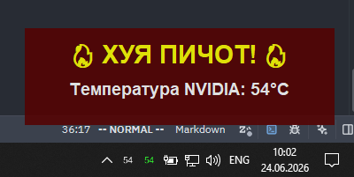
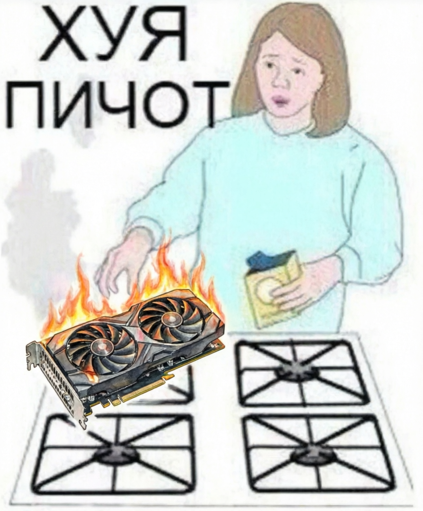

# Huya Pichot 

Простой мониторинг и нотификация на всех мониторах если любая температура стала выше 75 градусов + иконки в трее которые показывают температуру:

* CPU - белая (требует прав администратора)
* Nvidia - зеленая
* Amd - красная

Пример нотификации, в правом нижнем углу, с иконками температуры:

## Зависимости

* python
* uv
* [LibreHardwareMonitor](https://github.com/LibreHardwareMonitor/LibreHardwareMonitor)

## Установка и запуск

1) `git clone https://github.com/Apkawa/huya_pichot.git`
2) Скачайте [последний релиз LibreHardwareMonitor](https://github.com/LibreHardwareMonitor/LibreHardwareMonitor/releases) и распакуйте в папку с проектом.
3) запустите run.cmd с правами администратора 
> [!NOTE]
> можно без прав администратора, тогда будут доступны только GPU температуры

## Почему это появилось

Я играю в игры на телевизоре подключенным по hdmi к ноутбуку, и однажды я не заметил того что у ноута отключилась охлаждающая подставка. Ноутбук был прям огненным.

Данную ситуация отлично иллюстрирует мем:

И у меня появилось желание иметь какое то оповещение чтобы во время игры предупреждало о перегреве.

## Похожие проекты

Прям как у меня - я пока еще не нашел

**Выводят температуру в трее**

* https://github.com/Fergo/TrayTemperature
* https://github.com/justinnas/StarTray-Temperature 
* https://github.com/nmd-113/Tray-Temps

**Алерт**

* https://github.com/xvxvdee/GPU-Temperature-Alerts - просто алерт но в обычном оповещении. легко пропустить если на телеке играешь.

## TODO

### v0.1

- [ ] Порефакторить на полноценное модульное приложение, тесты
- [ ] cli
- [ ] toml конфиг
- [ ] разделение датчиков по устройствам а не по брендам, в системе могут быть несколько видеокарт nvidia
- [ ] при включении egpu добавлять новую иконку (на данный момент только перезапуск)
- [ ] задать температуру. возможно разделение порога в зависимости от видеокарты, какой то выше, какой то ниже.
- [ ] длительность оповещения и интервал между повторами
- [ ] конфиг алерта (текст, размер, цвет, положение)
- [ ] конфиг иконки (цвет, фон, текст)
- [ ] логгирование температуры и каких то параметров (хотя может быть лучше отдать на откуп другим тулзам)
- [ ] i18n
